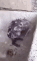

# Bord av kategorier
- [Chrome tillägg](#Chrome-tillägg)
- [Gratis Bilder](#Gratis_bilder)
- [Stock Videor](#VS_Code_tillägg)
- [Gratis kod editorer](#Gratis_kod_editorer)
- [Fonter](#Fonter)
- [Ikoner](#Ikoner)
- [Stock videor](#Stock_Videor)
- [Ljud](#Ljud)
- [Online design verktyg](#Online_designverktyg)
- [Webbsidsbyggare](#Webbsidsbyggare)

# Chrome-tillägg

| Link  |   description |
| -------- | -------- |
| [Ad-Block](https://getadblock.com/) | Använd AdBlock för att stoppa irriterande annonser och förbättra webbläsarhastigheter |
| [Custom Cursor](https://custom-cursor.com/) | Byter hur din Kursor ser ut! |
| [Dark reader](https://darkreader.org) | Gör alla sidor till mörk-läge |
| [Boxel Rebound](https://dopplercreative.com) | Litet minigame var man skall hoppa om man tiltar |
| [Valutaomvandlare](https://chrome.google.com/webstore/detail/currency-converter/dkpedpjjafnceedhomeijlphmjbblmdj/related?hl=sv) | Omvandlar valutor, daa |
| [SketchPad](https://chrome.google.com/webstore/detail/sketchpad/eekbbmglbfldjpgbmajenafphnfjonnc/related?hl=sv) | Du kan rita nogot om man får jävligt tråkigt. |
| [Convertio](convertio.co) | Du kan konvertera bilder, filmer och ljud med ett simpelt klick |
| [Relaxing Sounds](www.giovesoft.com) | Relaxerande ljud |
| [cats.](https://chrome.google.com/webstore/detail/cats/pdfklfdfahcjkkkogigggbfhbojcnhgb/related?hl=sv) | Olika katt-bilder |
|

 

# Gratis_bilder

| Link | Description |
| --- | --- |
| [Pixabay](www.pixabay.com) | Pixabay en av de allra bästa digitala bildbankerna. Här skänker fotografer bort sina bilder – och du kan använda dem (nästan) hur du vill utan någon registrering. |
| [pxhere](www.pxhere.com) | Pxhere är en bildbank med ungefär samma upplägg som Pixabay. |
| [MorgueFile](www.morguefile.com) | Klassiska Morguefile grundades redan 1996, men den är fortfarande populär. |
| [Unsplash](www.unsplash.com) | Unsplash är en sajt med över en halv miljon fria bilder, och en kul finess är avdelningen Wallpapers. |
| [GratisOgraphy](www.gratisography.com) | Foton från bildbyråer är ofta ganska förutsägbara. Söker du något mer personligt kan du gå in på Gratisography. |
| [Pexels](www.pexels.com) | Pexel är inte bara en fri bildbank – det är dessutom en sökmotor för bilder. |
| [EverystockPhoto](www.everystockphoto.com) | Det finns gott om upphovsrättfria bilder på sajter som Flickr och Wikimedia. | 
|  [Google](https://www.google.com/search?q=google+pics&rlz=1C1GCEA_enFI914FI914&sxsrf=ALeKk03oQK966UoqqynJYsYdHff6RckFoQ:1612163933971&source=lnms&tbm=isch&sa=X&ved=2ahUKEwj0mOrUksjuAhXBl4sKHauvBUIQ_AUoAXoECBEQAw&biw=1920&bih=937) | Bästa bild sök motoren. |
|

 

# VS_Code_tillägg

| Link | Description |
| --- | --- |
| [LiveServer](https://marketplace.visualstudio.com/items?itemName=ritwickdey.LiveServer) | Kör en Live lokal server som laddar vart efter. |
| [Prettier](https://marketplace.visualstudio.com/items?itemName=esbenp.prettier-vscode) | gör din kod snyggare! WOW |
| [BracketPairColorizer](https://marketplace.visualstudio.com/items?itemName=CoenraadS.bracket-pair-colorizer) | Gör olika brackets samma färg |
| [AutoRenameTag](https://marketplace.visualstudio.com/items?itemName=formulahendry.auto-rename-tag) | Åternamnger olika tags |
| [CSSPeek](https://marketplace.visualstudio.com/items?itemName=pranaygp.vscode-css-peek) | Låter dig sneak peeka på css classer i html koden |
| [PeaCOCK](https://marketplace.visualstudio.com/items?itemName=johnpapa.vscode-peacock) | Låter dig ändra temat på vscode |
| [Colorize](https://marketplace.visualstudio.com/items?itemName=kamikillerto.vscode-colorize) | Previewar färgerna i css |
| [CodeSpellChecker](https://marketplace.visualstudio.com/items?itemName=streetsidesoftware.code-spell-checker) | Grammarly för din kod |
|

 

# Gratis_kod_editorer

| Link | Description |
| --- | --- |
| [VScode](https://code.visualstudio.com/) | Gratis. Byggt på öppen sårce. kör var som helst |
| [Atom](https://atom.io/) | En hackbar textredigerare för 2000-talet |
| [Sublimetext](https://www.sublimetext.com/) | Har en o-ändlig gratis trial |
| [Notepad++](https://notepad-plus-plus.org/) | notepad++ är en gratis källkodsredigerare och Notepad-ersättning som stöder flera språk. |
| [Bluefish](https://sourceforge.net/projects/bluefish/) | Bluefish är en kraftfull redaktör för erfarna webbdesigners och programmerare. |
| [Brackets](http://brackets.io/) | En modern, redigerare med öppen källkod som förstår webbdesign. |
| [Codeshare.io](https://codeshare.io/) | En kodredigerare online för intervjuer, felsökning, undervisning och mer ... |
| [VIM](https://vim.org/) | ... du är den typ av person som inte bara dyker in i koden utan lever och andas den. Om du har någon Linux-installation är Vim något för dig |
| 

 

# Fonter

| Link | Description |
| --- | --- |
|[GoogleFonts](https://fonts.google.com/) | Gör webben vackrare, snabbare och öppnare med bra typografi. |
| [DaFont](https://www.dafont.com/) | Arkiv med fritt nedladdningsbara teckensnitt. Bläddra efter alfabetisk lista, efter stil, efter författare eller efter popularitet. |
| [1001Fonts](https://www.1001fonts.com/) | 25179 gratis teckensnitt i 13699 familjer · Gratis licenser för kommersiellt bruk |
| [Fonts.com](https://www.fonts.com/) | Bläddra och hitta det bästa urvalet av högkvalitativa skrivbords- och webbteckensnitt. |
| [MyFonts](https://www.myfonts.com/) | platsen # 1 för att ladda ner fantastiska font-face webbfonter och skrivbordsteckensnitt |
| [AdobeFonts](https://fonts.adobe.com/fonts) | Sök efter teckensnitt efter gjuteri, designer, fastigheter, språk, klassificeringar och mer. |
| [1001FreeFonts](https://www.1001freefonts.com/) | 54663 teckensnitt i 26394 familjer. Ladda ner gratis teckensnitt för Windows och Mac. |
| [FontSquirrel](https://www.fontsquirrel.com/) | Font Squirrel letar efter internet efter legitima gratis typsnitt av hög kvalitet. |
|

 

# Ikoner

| Link | Description |
| --- | --- |
| [Flaticon](https://www.flaticon.com/) | Gratis vektorikoner i SVG, PSD, PNG, EPS-format eller som ICON FONT. |
| [Icons8](https://icons8.com/icons) | Varje ikonstil har sin egen perfekta pixelstorlek så att du är täckt. |
| [Material](https://material.io/icons/) | Materiella ikoner är underbara, vackert utformade symboler för vanliga handlingar och föremål |
| [IconFinder](https://www.iconfinder.com/) | Iconfinder är världens största marknadsplats för vektor- och rasterikoner |
| [NounProject](https://thenounproject.com/) | Noun Project har den mest olika samlingen av ikoner |
| [FreeIcons](https://freeicons.io/) | Freeicons är en gratis plattform för nedladdning av vektorikoner |
| [Freepik](https://www.freepik.com/popular-icons) | Hitta och ladda ner de mest populära gratisikonsfilerna på Freepik |
| [StreamlineIcons](https://streamlineicons.com/) | Ladda ner 30000 gratis PNG-ikoner för webbplats, webbapp, programvara, webbdesign. |
|

 

# Stock_Videor

| Link | Description |
| --- | --- |
| [Pexels](https://videos.pexels.com/) | Gratis stockvideor av högsta kvalitet utan några strängar |
| [StockFootageForFree](http://www.stockfootageforfree.com/) | Otrolig kvalitet gratis stockvideor att ladda ner och använda |
| [Pixabay](https://pixabay.com/videos/) | Ett stort bibliotek med gratis stockvideoklipp i MP4-format |
| [Clipstill](http://www.clipstill.com/) | Slående filmstycken för att göra din webbplats tydligare |
| [Videezy](https://www.videezy.com/) | Ett brett utbud av högkvalitativa klipp, inklusive roliga bilder från luften |
| [Videvo](https://www.videvo.net/) | En community-baserad videosida som erbjuder massor av val |
| [Motionelements](https://bit.ly/36hl90c) | MotionElements är en online-arkivplats för nedladdning av gratis videoklipp. |
| [FOCA](https://focastock.com/) | Gratis videoklipp och och mallar som du kan använda på din webbplats, teman, mallar, utskriftsmaterial och sociala medier. |
|

 

# Ljud

| Link | Description |
| --- | --- |
| [FreeSFX](https://www.freesfx.co.uk/) | många olika ljud effekter i olika format |
| [FreeSound](https://freesound.org/) | låter dig snabbt hitta de ljud som kan användas för personligt bruk och som är begränsade för kommersiellt bruk. |
| [SoundsCrate](https://soundscrate.com/) | en utmärkt källa till ljudeffekter för kreativa och oberoende filmskapare |
| [PartnersInRhyme](https://www.partnersinrhyme.com/pir/PIRsfx.shtml) | levereras med tusentals royaltyfri musik och högkvalitativa ljudeffekter |
| [99sounds](http://99sounds.org/) | film till yttre rymden och till och med de senaste drone-ljudeffekterna |
| [FindSounds](http://www.findsounds.com/) | Har ingen egen databas men låter dig söka ljud och musik från internetet direkt |
| [ZapsPlat](https://www.zapsplat.com/) | erbjuder gratis ljudeffektbegäran |
| [OrangeFreeSounds](http://www.orangefreesounds.com/) | kommer med en rad kategorier från vattenljud och läskiga till gatuljud och diverse. |
|

 

# Online_designverktyg

| Link | Description |
| --- | --- |
| [Canva](https://www.canva.com/) | Ett av de mest kända gratis grafiska designverktygen |
| [Pikochart](https://piktochart.com/) | ett onlineverktyg för att skapa infografik |
| [Pablo](https://pablo.buffer.com/) | ett gratis verktyg från den sociala medieplattformen Buffer |
| [Pixlr](https://pixlr.com/) | very good yes | 
| [Snappa](https://snappa.com/app) | fokuserat på att skapa och redigera grafik, snarare än foton.|
| [Placeit](https://placeit.net/) | Placeit infogar automatiskt en bild efter eget val i ett brett utbud av lagerfotomallar. | 
| [UnSplash](https://unsplash.com/) | Unsplash är ett bibliotek med tusentals högupplösta fotografier. |
| [Figma](https://www.figma.com/graphic-design-tool/) | Alla element du behöver för att skapa fantastiska logotyper, grafik på sociala medier, presentationer och mer, gratis.|
|

 

# Webbsidsbyggare

| Link | Description |
| --- | --- |
| [Wix](https://www.wix.com/) | Upptäck plattformen som ger dig friheten att skapa, designa, hantera och utveckla din webbnärvaro precis som du vill. |
| [Squarespace](https://www.squarespace.com/) | Enkla verktyg för dina stora idéer. |
| [NetworkSolutions](https://www.networksolutions.com/) | Bygg din online-närvaro. Göra intryck. |
| [web.com](https://www.web.com/) | Bygg en webbsida i bara tre enkla steg |
| [Site123](https://app.site123.com/?aff=370034&sid=EN-22121907&l=en&landingSystem=1) | Skapa en webbsida med färdiga stilar och layouter. |
| [WordPress](https://wordpress.com/create/?aff=30102&sid=EN-22121907) | WordPress ger dig allt du behöver för att starta din webbsida idag. |
| [HostGator](https://www.hostgator.com/) | Webbhotell som skalas från lätt till expert |
| [BigCommerce](https://www.bigcommerce.com/dm/sb-affiliate/?irgwc=1&utm_term=UTV2-60qbxyLWzVwUx0Mo3EAUkERa1X34X5t1Q0&utm_content=159259&utm_campaign=422058&utm_medium=affiliates&utm_source=ImpactRadius) | Bygg en webbsida som tillgodoser dina unika affärsbehov - med designverktyg, funktioner och support för att få dig igång. |
|